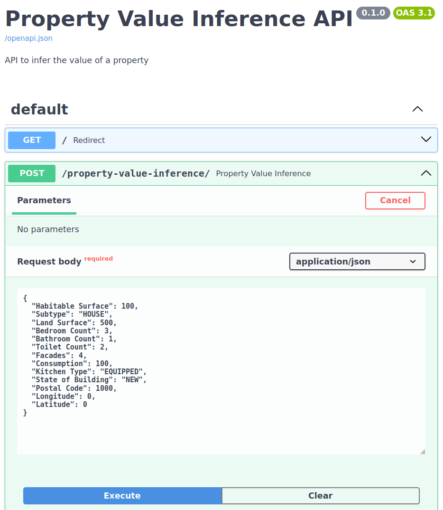
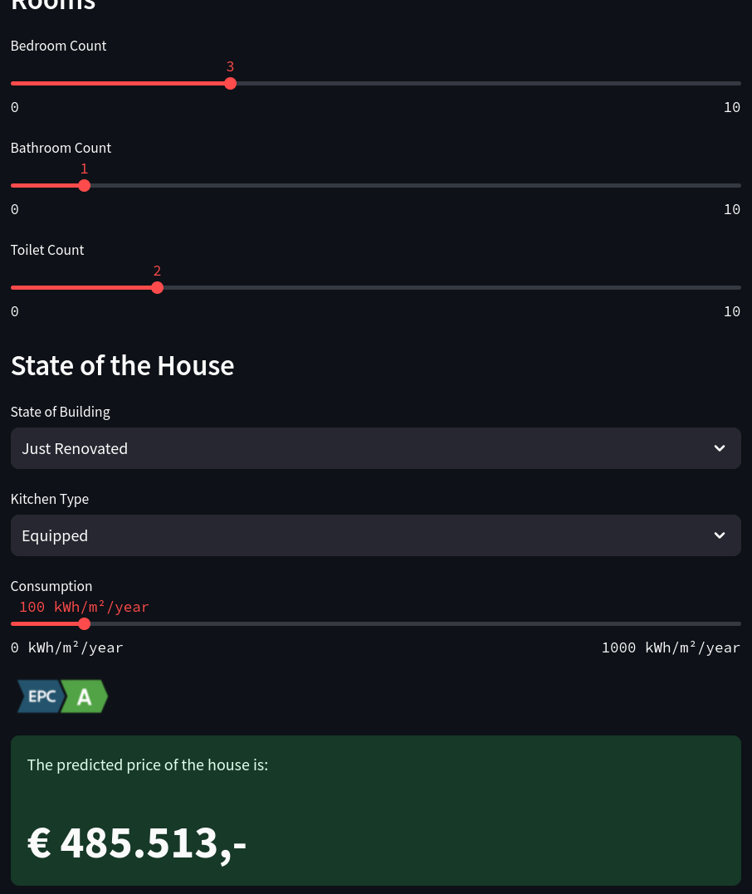

# Immo Prediction App with 🦀 Charlie 🦀


## 🏢 Description
In the preciding project I build a model with Charlie 🦀 to predict the price of a house, in this project we will 
deploy the model with FastAPI and Streamlit. FastAPI for other developers to use the model and Streamlit for the end-user.

## 📦 Repo structure
```
.
├── backend  # FastAPI
│   ├── config.py
│   ├── Dockerfile
│   ├── features
│   │   ├── build_features.py
│   │   ├── pipeline.py
│   │   └── transformers.py
│   ├── main.py
│   ├── models
│   │   └── catboost.pkl
│   ├── requirements.txt
│   ├── schemas
│   │   ├── address_schema.py
│   │   ├── property_schema.py
│   │   └── value_shema.py
│   └── utils.py
├── docker-compose.yml
├── frontend # streamlit
│   ├── app.py
│   ├── config.py
│   ├── Dockerfile
│   ├── images
│   ├── requirements.txt
│   └── utils.py
├── README.md
└── requirements.txt
```
## Online Live Demo!
It is a bit slow because it is hosted on a free server, but it works! Please be patient.
* [Immo Prediction Frontend with Streamlit](https://immo-eliza-streamlit.onrender.com)
* [Immo Prediction Backend with FastAPI](https://immo-eliza-app.onrender.com/)

## 🚀 Launch the app locally
```bash
sudo docker compose up -d --build
```
## Screenshot
### FastAPI


View live demo: [Immo Prediction Backend with FastAPI](https://immo-eliza-app.onrender.com/)
### StreamLit


View live demo: [Immo Prediction Frontend with Streamlit](https://immo-eliza-streamlit.onrender.com)

## ⏱️ Timeline
This project was done in 5 days including studying the theory and implementing the code.

## 📌 Personal Situation
This project was done as part of my AI trainee program at BeCode.

### Connect with me!
[](https://www.linkedin.com/in/gerrit-geeraerts-143488141)
[](https://stackoverflow.com/users/10213635/gerrit-geeraerts)
[](https://askubuntu.com/users/1097288/gerrit-geeraerts)

